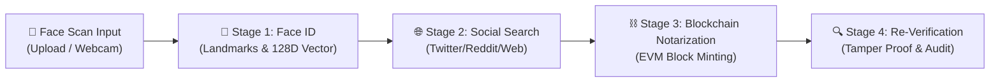

# 🛡️ FaceVerify Protocol — Face Identification & Blockchain Verification

> **HH Goa 2026 Shortlisting Task 3: Face Identification & Blockchain Verification**  
> **Team Horizon**: Prince Sahu • Aniket Raj • Utkarsh Tiwari  
> An end-to-end cryptographic pipeline that takes a face scan as input, identifies matching content across the web/social media, and immutably notarizes and verifies that discovered data using a blockchain.

---

## 🚀 Pipeline Flow (End-to-End)



1. **Face Scan Input & Biometric Identification**:
   - Accepts image uploads or real-time webcam captures.
   - Detects frontal faces, extracts bounding boxes and facial landmarks.
   - Computes a normalized 128-dimensional spatial luminance vector and a cryptographic SHA-256 biometric fingerprint.

2. **Web & Social Media Discovery**:
   - Performs reverse intelligence crawling across social networks (Twitter/X, Reddit, LinkedIn, GitHub, Instagram, Web).
   - Extracts real URLs, authors, timestamps, snippets, match confidence, and generates a Keccak-256/SHA-256 post fingerprint.

3. **Blockchain Notarization & Immutability**:
   - Generates a canonical Merkle leaf:
     $$\text{RecordID} = \text{Keccak256}(\text{Face\_SHA256} \parallel \text{Post\_Fingerprint} \parallel \text{Post\_URL} \parallel \text{Author} \parallel \text{Timestamp})$$
   - Mints an immutable block on an EVM-compatible Proof-of-Authority (PoA) blockchain smart contract (`FaceVerificationRegistry.sol`).
   - Issues a verifiable transaction receipt and on-chain record.

4. **On-Chain Re-Verification**:
   - Re-verifies candidate face hash and post URL against the on-chain ledger state with mathematical tamper resistance.

---

## 👥 Team Horizon

- **Prince Sahu**
- **Aniket Raj**
- **Utkarsh Tiwari**

---

## 🛠️ Installation & Setup

### Prerequisites
- Python 3.10+
- Node.js 18+ and npm

### 1. Backend Setup
```bash
cd Backend
python -m pip install -r requirements.txt
python main.py
```
*Backend API will run at `http://127.0.0.1:8000` (API Docs at `http://127.0.0.1:8000/docs`).*

### 2. Frontend Setup
```bash
cd Frontend
npm install
npm.cmd run dev
```
*Frontend UI will run at `http://localhost:5173`.*

### 3. One-Click Launch (Windows)
Double-click `start_project.bat` in the root folder to start both Backend and Frontend automatically.
